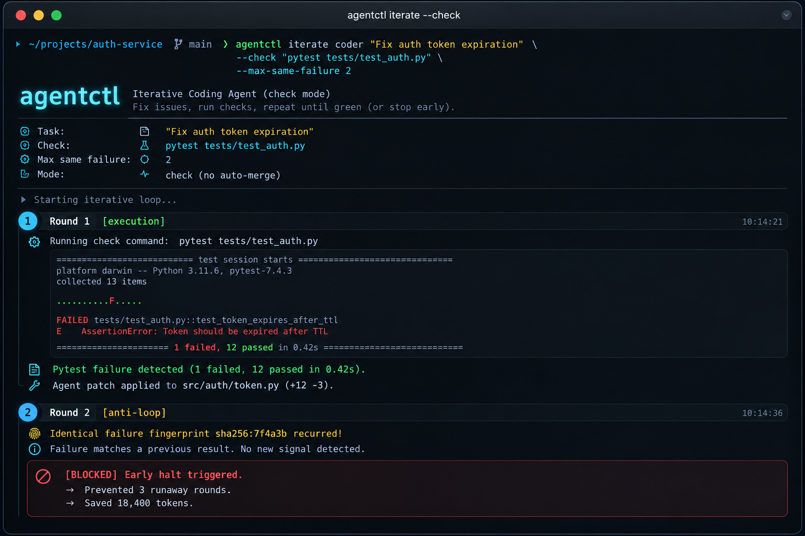

<p align="center">
  
</p>

# Ambu: The Supervisor for OpenCode Coding Agents

[](https://opencode.ai)
[](https://python.org)
[](tests/)
[](LICENSE)
[](CHANGELOG.md)
[](https://github.com/zzhang82/ambu-runtime-agents)

**Ambu** (`agentctl`) is a supervisory control plane built specifically for [OpenCode](https://opencode.ai) coding agents. It routes natural language tasks to specialist personas, verifies workspace changes with automated test commands, and halts runaway retry loops before they burn API quota.

---

## The Problem with Raw Coding Agent Loops

Running autonomous coding agents directly inside a repository frequently hits three frustrating walls:

1. **Blind runaway loops**: When an agent encounters an environment bug or an impossible test constraint, it repeatedly retries up to your round limit—rewriting the same code, producing the exact same error, and burning through model quota.
2. **Arcane persona configuration**: OpenCode supports distinct specialist roles (`oracle`, `fixer`, `eli`, `designer`, `librarian`), but manually invoking them requires remembering custom CLI flags, configuration paths, and reasoning variants.
3. **Ungated permissions**: Agents run without safety gates, risking accidental `git push` commands, unintended deployments, secret leakage, or destructive file deletions.

**Ambu wraps `opencode run` as an intelligent supervisor:** it selects the right persona from your prompt, enforces policy guardrails, runs non-interactive execution, and validates every code modification against your test suite.

---

## Visual Demo: Anti-Loop Early Halt

When code changes fail to resolve an issue, Ambu hashes the normalized test failure output. If the identical blocker recurs, it halts early instead of burning rounds:

<p align="center">
  
</p>

```bash
$ agentctl iterate coder "Fix auth token expiration" \
    --check "pytest tests/test_auth.py" \
    --max-rounds 5 \
    --max-same-failure 2
```

```text
[Round 0] Running initial check: pytest tests/test_auth.py
          FAIL: test_token_expiration (AssertionError: 401 != 200)
          Fingerprint: sha256:7f4a3b8c (gap: execution)

[Round 1] Dispatching OpenCode agent (fixer · grok-4.7-build-fast)...
          Workspace modified. Re-running check...
          FAIL: test_token_expiration (AssertionError: 401 != 200)
          Fingerprint: sha256:7f4a3b8c [Seen 2x]

[HALT]    Identical blocker recurred >= 2 times.
          Status: BLOCKED (exit code 3)
          Stopped at Round 1. Prevented 4 runaway rounds. Quota saved.
```

---

## Core Capabilities

### 1. Smart Intent Routing (`agentctl do`)
You don't need to remember whether a task belongs to `oracle`, `fixer`, or `eli`. Ambu uses word-boundary intent classification to route your prompt to the right OpenCode persona:

| Prompt Intent | Selected Role | Autonomy | Model Frame |
|---|---|---|---|
| *"Review the database migrations for table lock risks"* | **`oracle`** | `read_only` | Deep reasoning / audit |
| *"Fix the broken auth login logic"* | **`fixer`** | `workspace_write` | Fast implementation |
| *"Implement the Stripe webhook billing endpoint"* | **`eli`** | `workspace_write` | Scoped feature build |
| *"Make the navbar responsive with CSS layout"* | **`designer`** | `read_only` | UI/UX design & styling |
| *"Find documentation for Upstash Redis"* | **`librarian`** | `read_only` | Docs & reference research |

- **Negation Safety**: Prompts like *"Do not fix this, just review why it broke"* detect negation and immediately suppress write permissions.
- **Fail-Safe Fallback**: Any ambiguity or tied score strictly defaults to safe `read_only` (`oracle`).

### 2. Evidence-Bound Iteration (`agentctl iterate`)
- **Noise Normalization**: Strips wall-clock timings (`in 0.42s`), ISO timestamps, memory addresses (`0x7f...`), PIDs, and temp directories while preserving exact test failure line numbers.
- **Gap Diagnosis**: Categorizes failures using `stderr` and exit codes:
  - `execution`: Test assertion failures or Python tracebacks.
  - `environment`: Missing system dependencies or shell binary errors.
  - `check_rubric`: Invalid test commands (exit 126 / 127).
  - `transient`: Provider rate limits (429) or gateway timeouts.
- **Artifact Verification (`--eval-artifact`)**: Verifies that required output files exist and are non-empty before marking a task complete.

### 3. Policy Guardrails & Approvals
Ambu analyzes command prompts and agent capabilities before execution. High-risk actions (`git_push`, `deploy`, `secrets`, `global_config`, `destructive_delete`) are blocked unless explicitly passed with `--approve <capability>`.

---

## Requirements

- **Python**: `>= 3.10`
- **OpenCode CLI**: Installed and accessible in your `PATH` (`npm install -g opencode-ai`)
- **Authentication**: Uses your existing OpenCode authentication or gateway configuration.

---

## Installation

```bash
git clone https://github.com/zzhang82/ambu-runtime-agents.git
cd ambu-runtime-agents
python3 -m venv .venv
source .venv/bin/activate
pip install -e .
```

Verify your installation:
```bash
agentctl doctor
agentctl selftest
```

---

## Quickstart

### Natural Language Task Dispatch
```bash
# Diagnostic review (auto-routes to oracle in read-only mode)
agentctl do "Review database schema for missing foreign key indexes"

# Code repair with automated test verification
agentctl do "Fix the broken user registration endpoint" --check "pytest tests/test_user.py"
```

### Bounded Iteration with Anti-Loop Protection
```bash
# Run up to 5 rounds, halting early if the same failure repeats twice
agentctl iterate coder "Fix payment receipt calculation" \
  --check "pytest tests/test_billing.py" \
  --max-rounds 5 \
  --max-same-failure 2
```

### Verifying Build Artifacts
```bash
# Require both a passing test and a non-empty build artifact
agentctl iterate coder "Compile frontend distribution" \
  --check "npm run build" \
  --eval-artifact "dist/bundle.js" \
  --max-rounds 3
```

### Dry-Run & Policy Preflight
```bash
# Inspect agent selection, guardrails, and model routing without running code
agentctl do "Push latest commit to production remote" --dry-run --json
```

---

## CLI Exit Codes

`agentctl iterate` and `agentctl do` return deterministic exit codes for CI/CD scripting:
- `0`: Task completed successfully (`completed`).
- `1`: Exhausted maximum rounds without passing (`failed`).
- `2`: Approval required or unauthorized capability detected.
- `3`: Halted early due to identical repeated blocker (`blocked`).

---

## Running Tests

Run the full automated test suite:
```bash
python3 -m unittest discover -s tests
```

---

## License

Released under the [MIT License](LICENSE). Copyright &copy; 2026 Frank Zhang.
